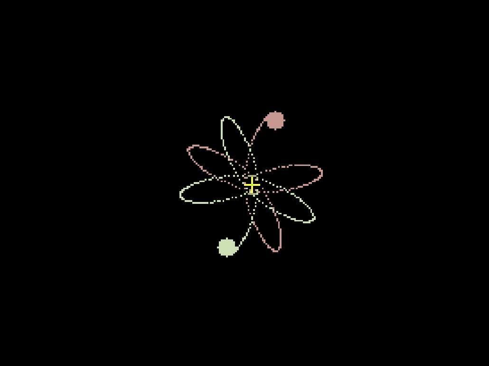
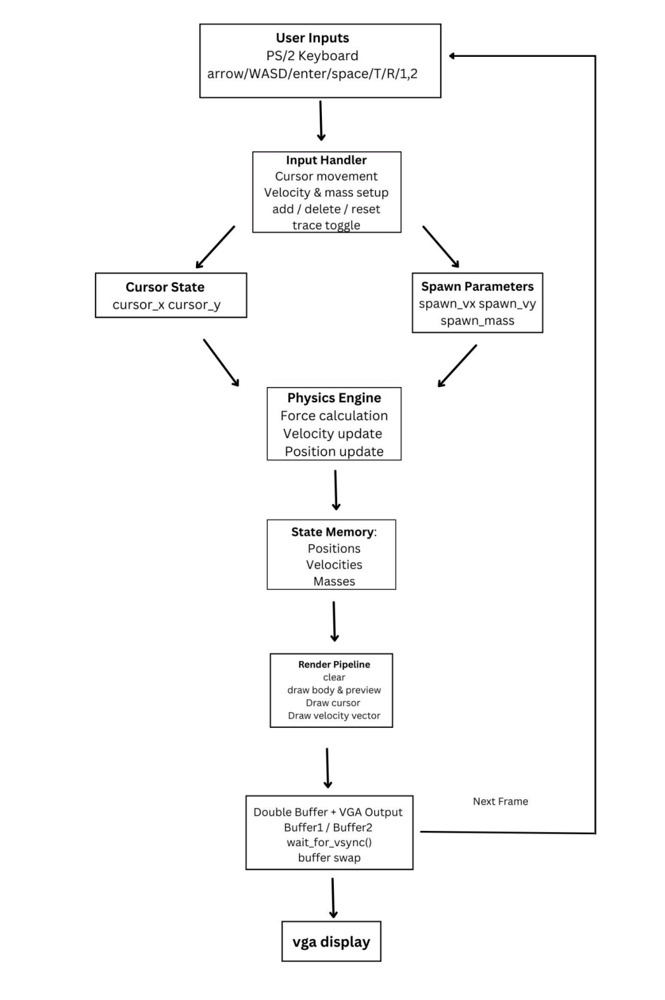
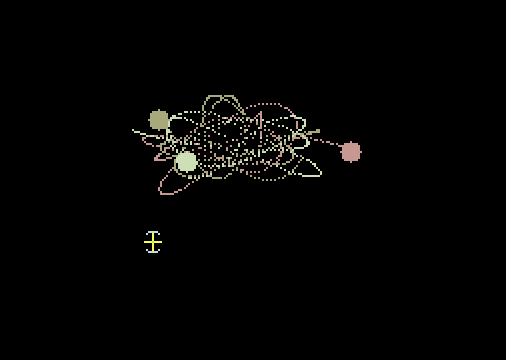
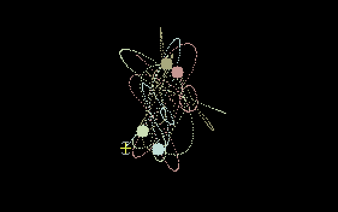

# N-Body Gravitational Simulator

> A real-time gravitational simulation developed in C for the DE1-SoC platform, featuring interactive object creation, orbital motion, and real-time visualization.

> **University of Toronto | ECE243 | Computer Organization Course Project**

> **Note:** The source code is not publicly available due to University of Toronto academic integrity policies.

---

## Overview

This project implements an interactive N-body gravitational simulator running on the DE1-SoC platform.

The simulator models gravitational interactions between multiple celestial bodies in real time while allowing users to create new objects and adjust their initial velocities through keyboard input. The simulation continuously updates object trajectories and visualizes the results using VGA graphics.

I was responsible for developing the physics engine and simulation logic, while my teammate implemented the VGA rendering system.

---

## Features

- Real-time N-body gravitational simulation
- Interactive object creation through keyboard input
- Adjustable initial velocity for new objects
- Collision handling between celestial bodies
- Continuous trajectory visualization
- Memory-mapped I/O on the DE1-SoC platform

---

## System Architecture

---

## My Contributions

### Physics Engine

- Implemented Newtonian gravitational force calculations
- Updated object positions and velocities in real time
- Designed the simulation update loop

### Simulation Logic

- Implemented collision detection and response
- Added orbital initialization logic
- Implemented interactive object creation with adjustable velocity

### Numerical Stability

- Applied softened gravity to avoid singularities
- Used fixed time-step simulation updates
- Implemented trajectory history buffers for continuous visualization

---

## Demonstration

2-body 

3-body 

4-body 

---

## Technical Challenges

### Maintaining Stable Simulation

Simulating gravitational systems requires careful handling of numerical instability when objects become very close to each other. To improve stability, the simulator applies softened gravity and updates the system using a fixed simulation time step.

### Interactive Simulation

The simulator supports creating new celestial bodies during runtime while maintaining continuous simulation without restarting the program.

### Real-Time Performance

The physics engine continuously updates object motion while coordinating with VGA rendering to provide smooth visualization.

---

## Code Availability

The source code for this project is **not publicly available** due to University of Toronto academic integrity policies.

This repository serves as an engineering portfolio documenting the project architecture, implementation approach, and key design decisions.
